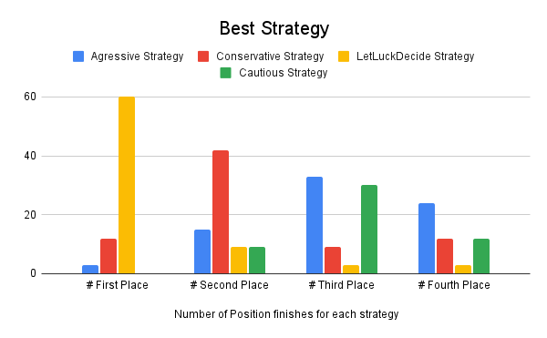

# 2023F CS2910 Project Report

**Group Members**

1. Ajeet Singh Gill (0346487)
2. Arnab Kundu (0355570)

# Summary of Game

Diamant is a board game based around cave exploration. The game is for 3-8 players, and the objective of the game is to
collect the most gems to win. The key objects in the game include treasure cards, trap cards, decision cards and
barricade tiles. There are 5 caves in which players must explore. Each turn, a deck consisting of treasure and trap
cards is randomly drawn. If a treasure card is chosen, the treasure is divided amongst players, meanwhile, if two
identical trap cards are chosen the round is over and the cave gets closed by a barricade tile. Players choose every
round either to exit or continue. The player with the most treasure at the end of the game is the winner.
https://cdn.1j1ju.com/medias/90/3c/55-diamant-rulebook.pdf

# Experiment Report

## Player Strategies

All Strategies are implemented after at least 2 cards are drawn, to allow for collection of treasure or possible
duplicate traps.

1. Agressive/Cautious Strategy: The Agressive Strategy and Cautious Strategy are two different strategies with similar
   implementations. The Agressive Strategy implements the random class to generate a random number. If the number is
   less than 0.8, the Stratrgy permits the player to keep exploring the cave, meaning a 80% chance for the player to
   keep exploring the cave. Similarly, the Cautious Strategy returns true after 2 rounds, meaning the Player will always
   exit the cave after 2 rounds.

2. Conservative Strategy: The Conservative Strategy is a random strategy. The player randomly inherits the random
   object. If the value is below the value of 0.5, the player exits the cave. Likewise, if the value is above 0.5, the
   player stays in the cave. This causes for the strategy to be a 50/50 strategy, with no way of predicting the outcome.

3. LetLuckDecide Strategy: The LetLuckDecide strategy is our final strategy, with similar implementations to the other
   strategies. This strategy implements the random class to generate a random number. If the number is less than 0.25,
   the Stratrgy permits the player to keep exploring the cave, meaning a 25% chance for the player to keep exploring the
   cave.

## Procedure

To setup our SimulationExperiment class, we first created orginal classes such as Card, Player, Game, Deck and Strategy.
The Card class is an abstract class, mainly used for the creation of Treasure and Hazard Cards, with a values and a
ToString method. The Player class consits of information about a Player, such as the name and number of gems. The Deck
Class uses a Stack to help shuffle cards (Treasure and Hazard Cards) in a random order, to create a new deck everytime.
The Game class implements the methods used to play the game. This includes methods such as start, entering/exiting the
cave, determining the winner and distributing the rubies evenly. Finally, the Strategy class contains 4 different
stratgies as previously mentioned. Altogether, the methods in these classes are used to make the SimulationExperiment
class, which randomly assigns one of the four strategies to players, adds players and simulates the game in entirety
with all 5 caves. The experiment compares the player strategies by determining which strategy collects the most number
of gems. This was determined by the trials, of which we did 75 of. The data collected was the number of gems collected
by each Player using a random strategy, which after we determined the best strategy.

## Results

We simulated 75 trials of our game and the results showed a clear winner. In our trials, we counted "First Place" as
having the most gems after all 5 caves were explored, "Second Place" having the second most gems, "Third Place" having
third most gems, and "Fourth Place" having the fewest number of gems after all 5 caves were explored in each simulation.

The strategy with the most First Place finishes was the LetLuckDecide strategy, with 60 finishes. The Conservative
Strategy had 12 finishes, and Agressive Strategy had 3 finishes while the Cautious Strategy had 0 First Place finishes.

The strategy with the most Second Place finishes was the Conservative Strategy, with 42 finishes. The Agressive Strategy
had 15 finishes, with the LetLuckDecide and Cautious Strategy each having 9 finishes.

The strategy with the most Third Place finishes was the Agressive Strategy, followed closely behind by the Cautious
Strategy, with 33 and 30 finishes, respectively. The Conservative Strategy had 9 Third Place finishes, and the
LetLuckDecide Strategy had 3 Third Place finishes.

Finally, the strategy with the least number of gems collected and most Fourth Place finishes was the Cautious Strategy,
with 36 finishes. The Agressvive Strategy had 24 finishes, with the Conservative Strategy having 12 finishes and
LetLuckDecideStrategy having 3 Fourth Place Finishes.



## Analysis

There was one Strategy which was clearly superior than the others. Conversly, there was one Strategy which performed
poorly consistenly.

The "best" strategy was clearly the LetLuckDecide Strategy, with 92% of finishes either in First Place or Second Place.
The LetLuckDecide Strategy had a moderate amount of risk, with a 25% chance for the player to keep exploring the cave,
which proved benefical for multiple reasons. First of all, the strategy rarely completed the whole round. This meant
that the player with this strategy would always be the second or third player leave the cave, almost always exiting the
cave before two identical trap cards where chosen while still collecting gems. Consequently, the strategy would always
collect more gems than the Cautious Strategy which left the cave after the first two cards were drawn, but would also
leave the cave before too many trap cards were drawn, and therefore leaving the cave with on average more gems than the
Aggressive Strategy and Conservative Strategy.

The second "best" strategy was the Conservative Strategy, with a 50% chance of the player to continue exploring the
cave. This strategy had 72% of finishes as either First or Second Place, with 56% of finishes being Second Place. This
strategy had more risk than the LetLuckDecide Strategy, as on average the player would have to stay in the cave longer,
resulting in more opportunity to lose gems collected due to identical trap cards. Still, it performed better than the
Agressive and Cautious Strategies, as the player would collect more gems on average.

The third "best" strategy was the Agressive Strategy. This strategy meant a 80% chance for the player to keep exploring
the cave. Consequently, this strategy was wildly inconsistent, with 3 First Place finishes and also 15 Second Place
finishes, resulting in almost a quarter of finishes in the top Places. The strategy had 44% of its finishes in Third
Place, which was predictive. With an 80% chance of staying the

cave, the strategy ran into more trap cards on average than the other 3 strategies, but also had more opportunity to
obtain gems. Unfortunately, with 3 trap cards and the luck of the draw, the chance to obtain duplicate trap cards in a
deck of 26 cards was lower than the chance of continuing the cave. This meant that since there was an 80% chance to
contine exploring the cave, and ~77% of the deck were treasure cards (~23% trap cards) that the player with the
Agressive Strategy was bound to run into duplicate trap cards, until the player was randomly chosen to exit the cave.

Finally, the worst strategy was the Cautious Strategy. This strategy always left the cave after at least 2 cards were
drawn, and had Third Place or Fourth Place finsishes 88% of the time, with 48% chance of finishing in Fourth Place and
no First Place finishes. This strategy was the worst because of the lack of risk taken. Since the deck consisted of
only ~23% of trap cards, the odds of getting duplicate cards drawn after a couple rounds was not very high, meaning the
strategies which implemented more risk ended up recieving more gems on average.

# Reflection

### What generative AI did you use, and what tasks did you use it for?

The two main AI agents used were Github Copilot (Used in Java IDE) and ChatGPT. We used Github Copilot to recommend
usable classes and interfaces based on its knowledge of Diamant, and create the backbone of these classes (constructor,
getters, setters, etc). After it construced classes such as Card, Deck, Game and Player, we used Copilot to create
methods inside these classes and also applied inheritance where necessary to create classes such as Hazard Card and
Treasure Card. In addition, ChatGPT was occasionally used for smaller fixes. As ChatGPT could not access our complete
code like Copilot could, ChatGPT was used for the creation of smaller methods, or in case we needed to debug any of the
code that we could not manually fix. In addition, ChatGPT suggested changes and removal of certain code.

### How did you learn about the tools used by your group (delete ones that don't apply)?

We learned about the tools we used through media exposure and due to using Generative AI in this project. ChatGPT has
been everywhere in the media lately due to it being able to help answer a multitude of questions. ChatGPT has been known
for a while by our two members. Contrary to ChatGPT, GitHub CoPilot is relatively new to both members. While Ajeet knew
about it through updates on GitHUb, Arnab only learned about it at the beginning of the project.

### Reflecting on your experience:

- What went well using generative AI in this project?

One of the advantageous aspects of generative AI was its celerity. Generative AI made learning efficient, explaining the
purpose of methods and also how to implement them. In addition, we didn’t have to pursue syntax online, as most of the
syntax was written, it was our job to implement it. Copilot also offered suggestions on code and methods to implement.
If we asked Copliot to create code and methods for our classes, Copilot would use code that we already implemented to
create new methods, seeing as it already had access to our code. This increased the speed of code, but also came with
some negative aspects. In addition, in order for the user to ask good questions the user must be articulate, making
yourself more comfortable and knowledgebale with the syntax and expertise in the domain. In addition, CoPilot generated
code which we wouldn't had thought about, so that we gott exposed to different and more advanced code. An example of
this was

```java
 public boolean equals(Object o){
        if(this==o)return true;
        if(!(o instanceof HazardCard))return false;
        HazardCard that=(HazardCard)o;
        return Objects.equals(hazardType,that.hazardType);
        }
```

which was more complex than the code already made for the equals method. All in all, Copilot (and ChatGPT) are good work
alongside partners for now. The AI helps, but makes many mistakes which both the user and the AI can learn from.

- What didn’t go well using generative AI?

There were few areas where the use of generative AI hindered development. First of all, there were many occasions where
Copilot suggested viable code which didn’t fit in with the code previously written, requiring us to go back and fix it.
This also resulted in the creation of unnecessary methods, and even fixing whole classes to make them abstract.
Additionally, AI doesn’t take into account the level of the coder, which sometimes results in advanced code being used.
For the most part, the code suggested by Copilot was fair, but there were occurrences where the code would be
progressive, resulting in changes. Consequently, debugging was a major part of the project, as we had to make the code
simpler.

- Were there any limitations you encountered using generative AI?

As the project progressed, we relaized that we coudln't use CoPilot for everything. We realized this as often times we
did not know the overall structure of the program, which would just cause more confusion. Additionally, we realized that
Copilot isn't good at making incremental changes. We would ask it to write methods/functions for certain sections and
build upon existing code, but CoPilot would often regenerate the code from scratch. When CoPilot did make code from
existing code, there was often errors which required debugging.

- How did your solution change/evolve/improve/degrade because of the generative AI?

As discussed previously, the generative AI helped make the backbone of the classes, but the creation of the solution was
heavily dependent on the two of us. Often times, CoPilot would complicate code, or would result in errors due to
assunption of previous code. In addition, CoPilot messed up the code flow of the project, requiring large amounts of
time just to debug mistakes.
